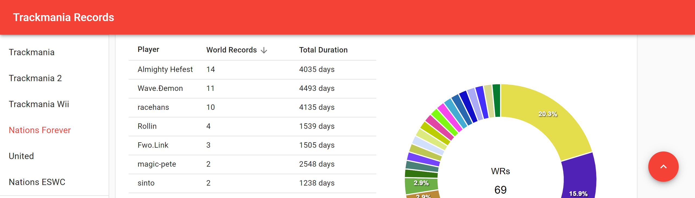

# trackmania-records

Inspired by the many many world records that people are setting every year.

## Date Sources

|Game|Scan Rate|History|Source|
|---|:-:|:-:|---|
|Trackmania|1-15/m|✓|[live-services.trackmania.nadeo.live](https://live-services.trackmania.nadeo.live)|
|Trackmania 2|1/d||[tm.mania-exchange.com](https://tm.mania-exchange.com)|
|Trackmanai Wii|1/d||[www.speedrun.com/tmwii](https://www.speedrun.com/tmwii)|
|Nations Forever|1/d|✓|[www.tm-exchange.com](https://www.tm-exchange.com)|
|United|1/d|✓|[www.tm-exchange.com](https://www.tm-exchange.com)|
|Nations ESWC|1/d||[www.tm-exchange.com](https://www.tm-exchange.com)|
